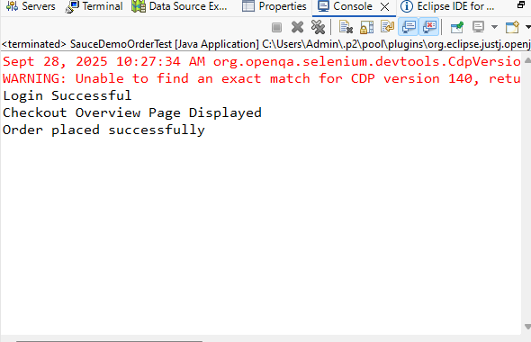

# Sauce Demo Automation Project

This project is a **Selenium WebDriver automation** for testing login and order functionality on the [Sauce Demo](https://www.saucedemo.com/) website.

---

## Project Overview

- **Language:** Java  
- **Tools:** Selenium WebDriver, ChromeDriver  
- **Purpose:** Automate login and checkout process for the standard user.  
- **Tested User:** `standard_user`  
- **Password:** `secret_sauce`

---

## Test Scenario / Flow

1. Open SauceDemo website.  
2. Login with valid credentials (`standard_user / secret_sauce`).  
3. Verify successful login.  
4. Add a product to the shopping cart.  
5. Proceed to checkout.  
6. Enter user information (First Name, Last Name, Postal Code).  
7. Verify Checkout Overview page.  
8. Complete the purchase.  
9. Verify order confirmation message.

---

## Output

---

## Demo Video

<video width="600" controls>
  <source src="Demo.mp4" type="video/mp4">
  Your browser does not support the video tag.
</video>

---

## Features

- Automates login for `standard_user`  
- Handles notifications and pop-ups  
- Simulates adding product and checkout process  
- Captures output screenshots and logs
